# Getting started with ForNAV for Business Central On Premise

To quickly setup ForNAV for Business Central On Premise please follow the steps in the flow chart. Alternatively you can follow the Next buttons to follow the guided online learning or just pick any subject you want to know more about from the menu on the left.

  
Next >>> Setup
 

## Quick Setup Guide

```mermaid
%%{init: {'theme': 'base', 'themeVariables': {
    'primaryColor': '#e64215',
    'primaryBorderColor': '#707173',
    'primaryTextColor': 'white',
    'secondaryColor':'#707173',
    'lineColor': '#707173',
    'edgeLabelBackground': '#707173',
    'tertiaryColor': 'white',
    'textColor': '#707173',
    'tertiaryBorderColor': '#e64215'
}}}%%

graph TD
  onprem01(On Premise)
  subgraph OnPrem
    onprem01 ==> onprem02[Add ForNAV Granule<br>to BC License]
    onprem02 ==> onprem03[Install ForNAV Designer<br>and Converter]
    onprem03 ==> onprem04{Installation Type}
    onprem04 ==> cs01(NAV2013 - BC14<br>C-Side)
    onprem04 ==> ex01(BC14 and over<br>Extensions)
    cs01 ==> cs02[Setup Fields webservice]
    cs02 ==> cs03[Connect the ForNAV Designer]
    cs03 ==> |NAV 2015 and higner only|cs04[Install Report Pack Fob]
    cs04 ==> cs05[Install Report Pack objects]
    cs05 ==> onprem99[Buy License]
    ex01 --> ex02[/BC14 Only<br>enable extensions/]
    ex02 ==> ex03[Connect the ForNAV Designer]
    ex03 ==> ex04[Install the<br>ForNAV Report Pack]
    ex04 ==> ex05[Edit your first report]
    ex05 ==> onprem99[Buy License]
  end

  click onprem02 "https://www.fornav.com/knowledge-base/fornav-granule-required/" _blank
  click cs02 "https://www.fornav.com/knowledge-base/troubleshooting-the-nav-web-service/" _blank
  click cs03 "https://www.youtube.com/watch?v=hIfv0Zfh2LQ" _blank
  click cs04 "https://www.fornav.com/knowledge-base/installing-objects-fornav-isv-granule-area/" _blank
  click onprem03 "./#/ForNAVForBCOnPrem/Setup?id=download" _blank
  click ex03 "./#/ForNAVForBCOnPrem/Setup?id=setup" _blank
  click ex04 "./#/ForNAVForBCOnPrem/Setup?id=install-the-fornav-report-pack" _blank
  click ex05 "./#/ForNAVForBCOnPrem/EditYourFirstReport" _blank

  classDef hyperlink color:#CCC;
  class onprem02,onprem03,cs02,cs03,cs04,ex03,ex04,ex05 hyperlink;
```

