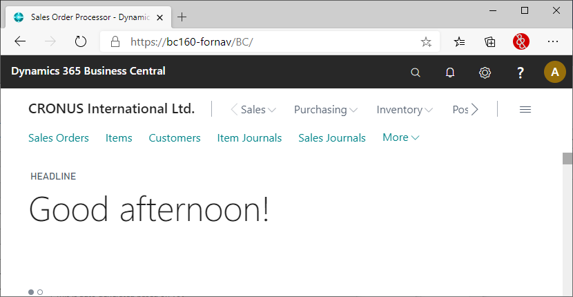

# Setup of the ForNAV designer

## Download
If you would like to do more than just adding a logo, payment note, etc., you need to edit the layout of the report with the ForNAV designer. The ForNAV designer lets you modify the data that is displayed on the layout, its location on the page, fonts and colours, and everything else you might need to modify.

In order to edit a ForNAV report you need to [download](https://www.fornav.com/download/) and install the ForNAV designer.

## Installation
The installation of the ForNAV designer is pretty straightforward. Please ensure you select the Full Installation.

## Setup
Once you have installed the ForNAV designer you need to set it up so it can connect to your instance of Business Central. ForNAV will work with both normal and [Docker](/ForNAVForBCOnPrem/DockerSetup.md) installations. Please refer to the [extension](/ForNAVForBCOnPrem/AddForNAVToYourExtension.md) guide to use your extension as a source for table and field information.

> By connecting the ForNAV designer to your Business Central instance ForNAV will be able to determine which tables and fields are available. This enables you to use tables and fields from both the base application and any extension that may be installed in your Business Central instance.

> The ForNAV Designer will store your settings in a connection string. You can copy this connection string so you can use it on another system. The ForNAV designer will keep a number of recently used connection strings in memory so you can switch easily.

If you don't know the address of your Business Central instance you can simply copy it from your Business Central Web Client. In this screenshot the address is https://bc160-fornav/bc. The first part of this address is the Server, https://bc160-fornav. The second part is the instance, bc.

## Install the ForNAV Report Pack
Once you have installed the ForNAV designer and configured it correctly you can install the [ForNAV Report Pack](https://www.fornav.com/standard-reports/) on your Business Central instance. This is not mandatory but we highly recommend it. The ForNAV Report Pack is a comprehensive set of reports that are optimized for ForNAV.

> In order to install the ForNAV Report Pack on a Business Central On Premise server you need to add the ForNAV granule to your Business Central license. You can get access to this granule by sending an e-mail to support@fornav.com stating your partner PSBC/VOICE number, and requesting access to the ForNAV ISV granule.

The first thing you need to do is to download the ForNAV Report Pack. You can do this from the ForNAV designer. Select New and then ForNAV Report Pack (Extension App).

Once you have downloaded the Report Pack app file you can upload it in you Business Central instance by selecting Extensions > Upload Extension.

<!-- ToDo Setup Report Pack -->

For further information you can watch the Coffeebreak video on On Premise setup.

    <iframe
        src="https://www.youtube.com/embed/DFHlyhhHqDY?start=56&end=726"
        frameborder="0"
        webkitallowfullscreen
        mozallowfullscreen
        allowfullscreen
        style="position: absolute; top: 0; left: 0; width: 100%; height: 100%;">
    </iframe>

