# Getting started with ForNAV for Business Central SaaS

<!-- 
Explain the function of this document. Offer the mermaid chart as a means to get started

Also start next buttons on every page to help guide the reader.

 -->

```mermaid
%%{init: {'theme': 'base', 'themeVariables': {
    'primaryColor': '#e64215',
    'primaryBorderColor': '#707173',
    'primaryTextColor': 'white',
    'secondaryColor':'#707173',
    'lineColor': '#707173',
    'edgeLabelBackground': '#707173',
    'tertiaryColor': 'white',
    'textColor': '#707173',
    'tertiaryBorderColor': '#e64215'
}}}%%

graph TD
  cloud01(Cloud)
  subgraph Cloud
    cloud01 ==> cloud02[Install from App Source]
    cloud02 ==> cloud03[Install ForNAV Designer<br>and Converter]
    cloud03 ==> cloud04[Set up the<br>ForNAV Designer]
    cloud04 ==> cloud05[Edit your first report]
    cloud05 ==> cloud06[Buy License]
  end

  click cloud02 "https://appsource.microsoft.com/en/product/dynamics-365-business-central/PUBID.fornav%7CAID.customizable_report_pack%7CPAPPID.83326d6d-11f8-49fd-981a-6f266a7c8d81" _blank
  click cloud03 "./#/ForNAVForBCSaaS/Setup?id=download" _blank
  click cloud04 "./#/ForNAVForBCSaaS/Setup?id=setup" _blank
  click cloud05 "./#/ForNAVForBCSaaS/EditYourFirstReport?id=editing-your-first-fornav-report" _blank

  classDef hyperlink color:#CCC;
  class cloud02,cloud03,cloud04,cloud05 hyperlink;
```

 

