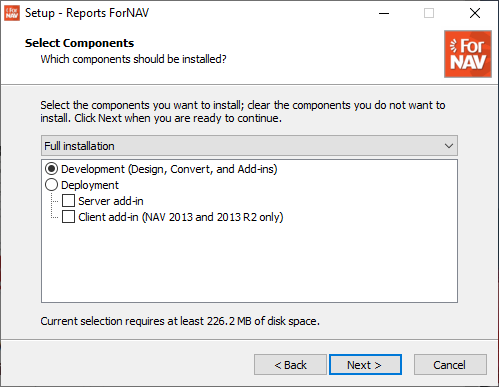
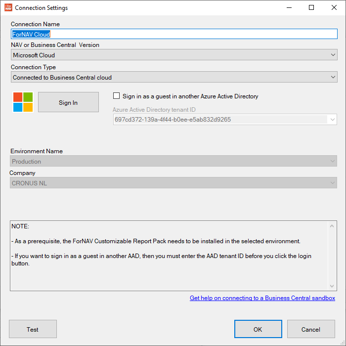

# Setup of the ForNAV designer

## Install the ForNAV Report Pack
To install the ForNAV report pack go to the Extension Management page, navigate to the Extension Market Place and search for ForNAV. When you find the Customizable Report Pack click on Trial Version to install.

## Download
If you would like to do more than just adding a logo, payment note, etc., you need to edit the layout of the report with the ForNAV designer. The ForNAV designer lets you modify the data that is displayed on the layout, its location on the page, fonts and colors, and everything else you might need to modify.

> In order to edit a ForNAV report you need to [download](https://www.fornav.com/download/) and install the ForNAV designer.

## Installation
The installation of the ForNAV designer is pretty straightforward. Please ensure you select the Full Installation.

## Setup
Once you have installed the ForNAV designer you need to set it up so it can connect to your Business Central Sandbox. To do this you need to open the ForNAV Designer and select Setup > Edit Connection.

> By connecting the ForNAV designer to your Business Central instance ForNAV will be able to determine which tables and fields are available. This enables you to use tables and fields from both the base application and any extension that may be installed in your Business Central instance.

> The ForNAV Designer will store your settings in a connection string. You can copy this connection string so you can use it on another system. The ForNAV designer will keep a number of recently used connection strings in memory so you can switch easily.

<!-- ToDo Setup Report Pack -->

For further information you can watch the Coffeebreak video on Cloud setup.

    <iframe
        src="https://www.youtube.com/embed/PX0qntKpe-s?start=55&end=709"
        frameborder="0"
        webkitallowfullscreen
        mozallowfullscreen
        allowfullscreen
        style="position: absolute; top: 0; left: 0; width: 100%; height: 100%;">
    </iframe>

