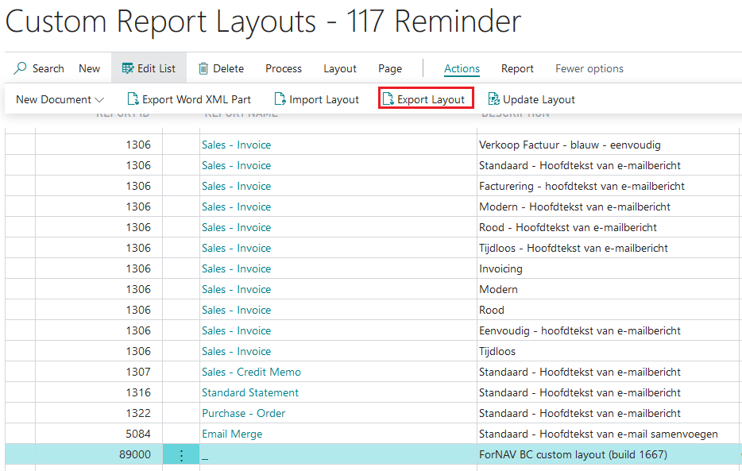
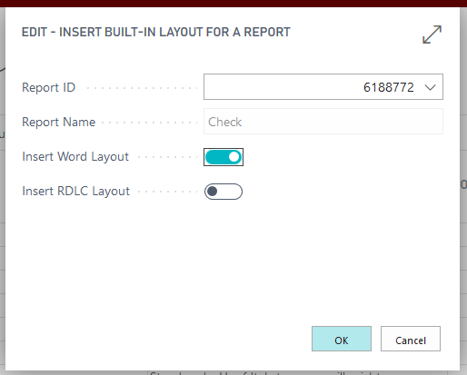
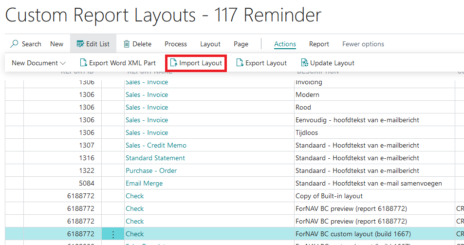
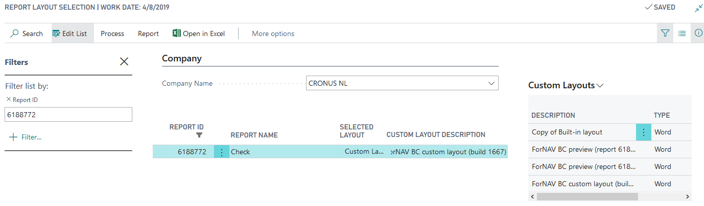

# Custom Report Layouts

## Export a ForNAV layout in ForNAV

* Open Business Central. Go to Custom Report Layouts.
* Select the Layout you want to export and select Actions > Export

* Save the resulting file.
* If you want to edit the layout file open the ForNAV designer, select open and find the exported file.

## Import a Custom Report Layout in ForNAV

* Open Business Central. Go to Custom Report Layouts.
* Select New. In the window that opens enter the report ID and select Insert Word Layout for Business Central Cloud and Insert RDLC Layout for Business Central On Premise.

* Rename the Custom Report Layout to something Recognizable.
* Select the Custom Report Layout that was created and select Actions > Import Layout

* In the Select File dialog box that appears select the docx file you want to import.
* In Business Central open the Report Layout Selections
* In the field Custom Layout Description select the new Custom Report Layout you just created.

