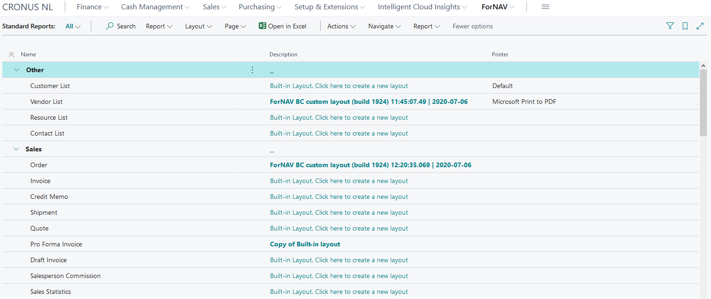
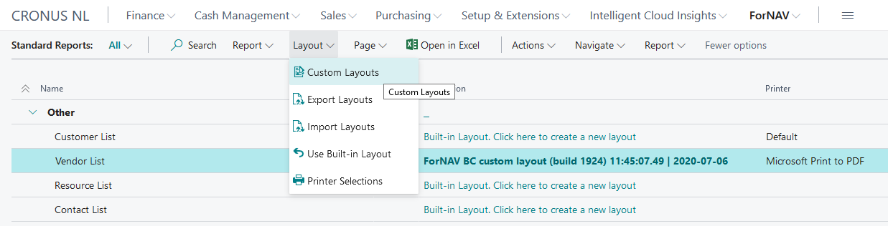
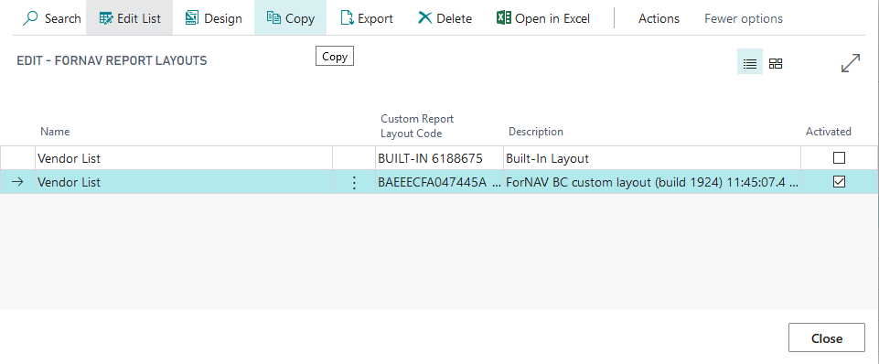
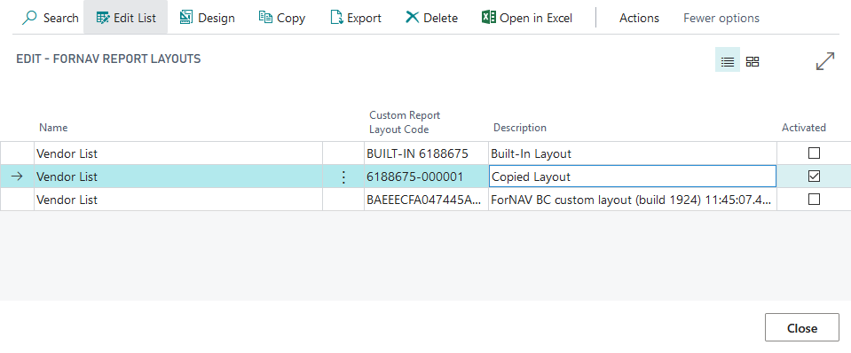
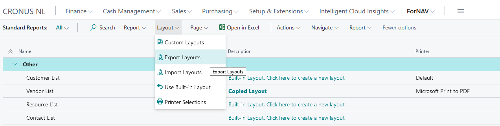
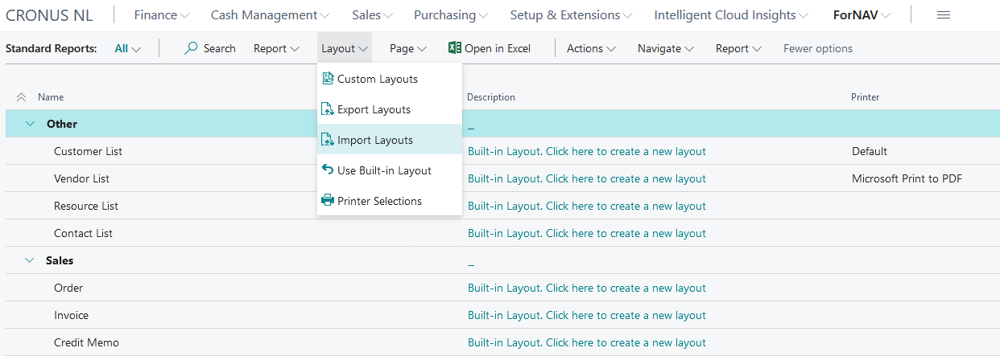
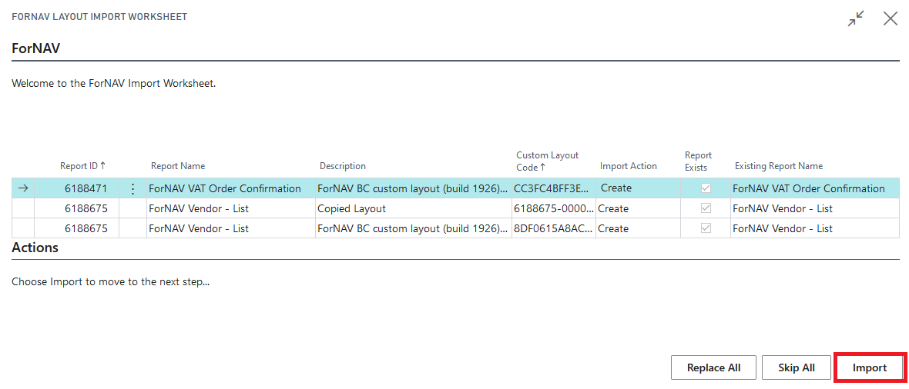

# Custom Report Layouts
In the ForNAV Customizable Report Pack version 5.3 the management of customized layouts has been significantly improved.

## Custom Report Layouts
All ForNAV reports have a built in layout. This is the default layout that ForNAV has designed for you. There are two ways of customizing the built in layout, by [cloning](), and by creating a customized layout.

A custom layout is a copy of the report layout that is stored in your Business Central database rather than in the extension package. You can create as many of these as you want and you can enable them per company.

When you edit a ForNAV report you have the option to save the changes as a custom report layout. When you don't have access to the source code of the extension package this is the only way of saving report changes.

## New Layout
When you want to edit the report layout you can now simply click on the layout description in the ForNAV Reports page. This will open the ForNAV designer. When you are done with designing the report simply click on Save As Custom Layout on Server to save your changes. ForNAV will create a custom report layout and enable it for the company you are currently working in.

## Copy Layout
Once you have created a new layout you can copy it. Select a report and click Layout > Custom Layouts.

To copy a layout you can select it and click copy. This will create a copy of the selected layout.

## Activate Layouts
To activate a layout all you need to do is select a report, open the Custom Layouts page and tick the Activated check box. This will activate the layout and cause Business Central to use it when running a report.

## Activate layouts in different companies
You can enable different layouts in different companies. To enable a layout for a specific company you need to open that company and enable your report layout.

## Export Layouts
To export your custom layouts you need to select Layout and click Export Layouts. This will open the ForNAV Report Layouts page where you can export your layouts.

You can also export your layouts from the Report Layouts of a specific report. In that case ForNAV will only export the layouts from that particular report.

## Import Layouts
If you want to import the layouts you need to select Layout > Import. You will need to select your exported layouts. This will bring up the import worksheet.

On the Layout Import Worksheet you can select which layouts you want to import. ForNAV will notify you if the layout you want to import already exists. Once you have selected which layouts you want to import you can click import. ForNAV will now import your layouts.

