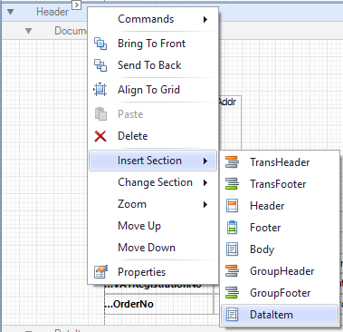
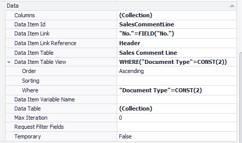
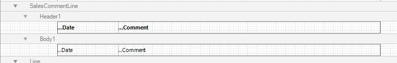
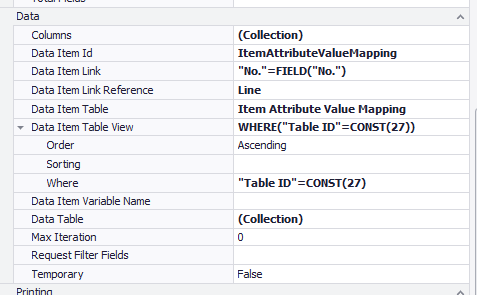

# DataItems
Sometimes it is necessary to get data from related records. If you want to print a line of data per record you can do this by adding a DataItem. This functionality is used for instance to show comment lines or item attributes under a sales line.

There are two ways of adding DataItems. As a Virtual or as an Actual DataItem. A virtual DataItem is a DataItem that does not exist in the object (AL) file of the report. ForNAV automatically determines if a DataItem is virtual or not. If you don't have access to the source object of the report DataItems are virtual. This can happen if you don't have permissions to edit extensions or if you edit a report from a protected extension like the ForNAV Customizable Report Pack.

## Adding a DataItem

Adding a DataItem begins with determining where you want to print the resulting lines. Lines from a new DataItem are always printed below the original DataItem. A standard sales document illustrates this, the document lines are always printed underneath the document header.

- Header
  - Line 1
  - Line 2
  - Line n

If you want to add comment lines you can choose to add them on the header:

- Header
  - Comment Line 1
  - Comment Line n 
  - Line 1
  - Line 2
  - Line n

Or the line:

- Header
  - Line 1
    - Comment Line 1
    - Comment Line n 
  - Line 2
    - Comment Line 1
    - Comment Line n 
  - Line n

To insert a new DataItem you can right click the DataItem that you want to add the new DataItem to. Move Up and Move Down lets you move the DataItem into the correct position.

Once you have inserted a DataItem you need to set the Data Item Table and Data Item Link properties. The Data Item Table View specifies further filters for your DataItem.

> If you are adding an actual DataItem you can only add tables from extensions that you have a dependency on. For virtual DataItems this is not necessary.

Once your DataItem has been set up correctly you can add sections so you can display data.

Another example for a DataItem to add is the Item Attributes:

## Edit an existing DataItem

For all DataItems, both built in and added, you can change some properties. The first are Calculated Fields. Business Central tables sometimes contain flowfields. These fields do not contain data in the database but need to be calculated. An example of this is the Amount field on the Sales Invoice Header. It calculates the total amount of all the Sales Invoice lines. If you need to use one of these fields in your ForNAV report you need to calculate it with the Calculated Fields property of your DataItem.

The second is the Data Item Table View. With this you can override the Built in sorting and filtering of your DataItems.