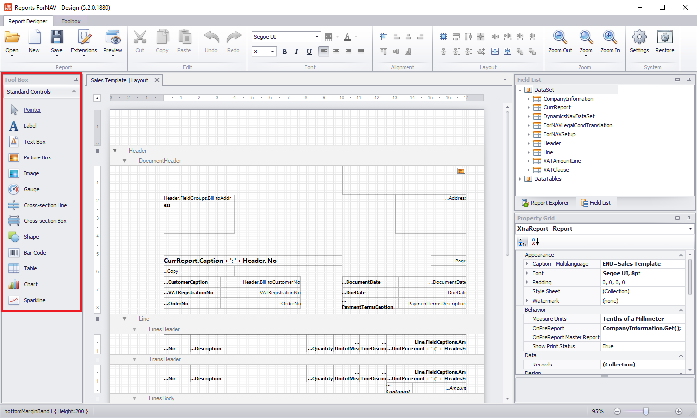
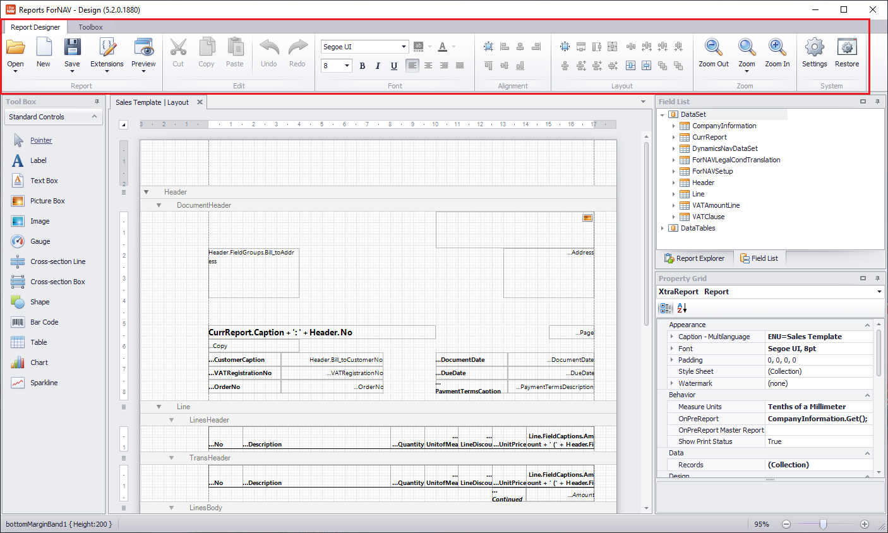
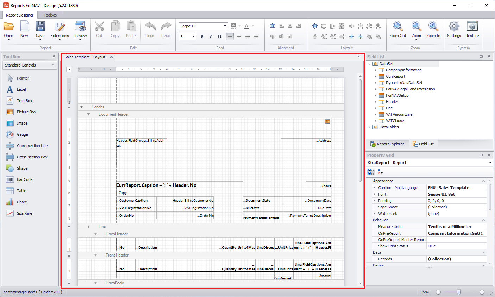
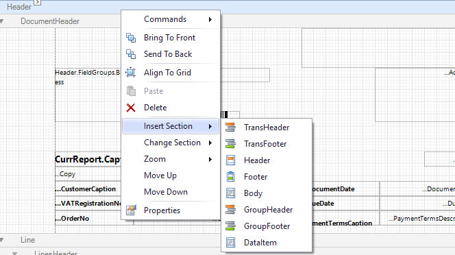
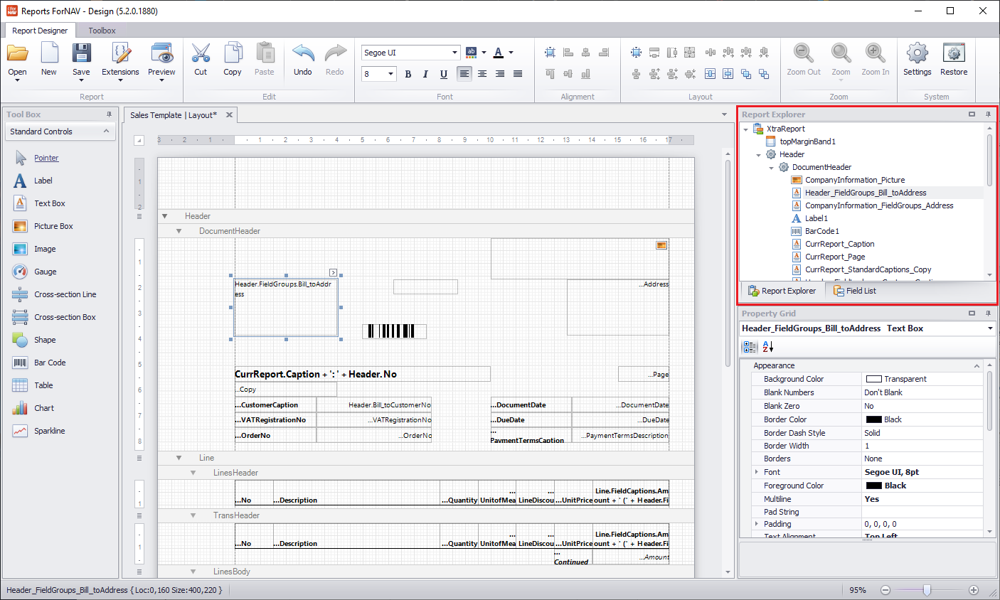
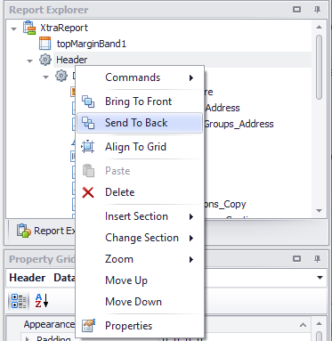
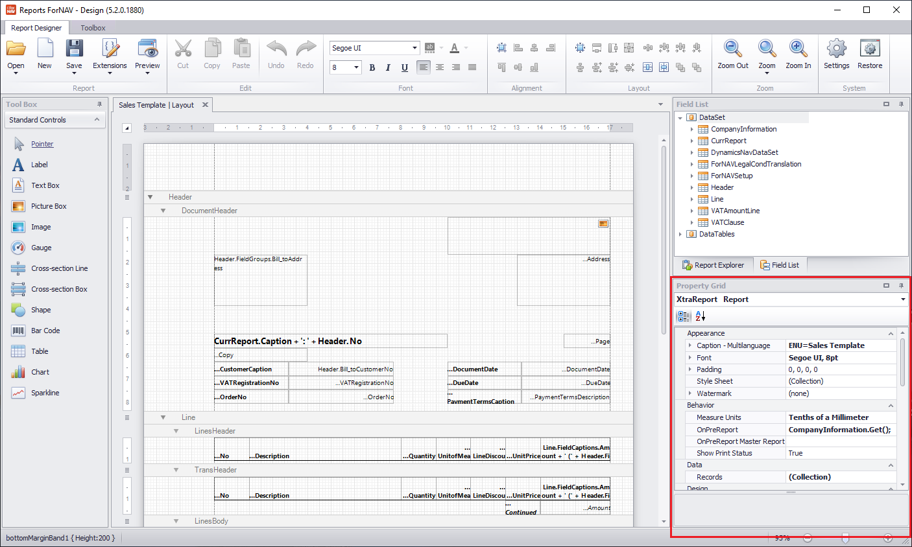
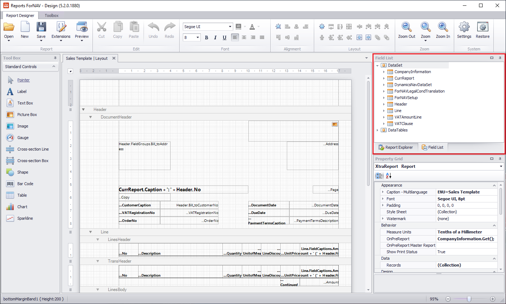

# The ForNAV Designer explained

## Standard Controls

|
Control
|Function|
|---------------------------|--------|
|Label                      |A multi language label. It can display formatted text, when you drill down on an entry ForNAV will open the Text Editor|
|Text Box                   |The most often used control in ForNAV. This accepts a Source Expression from the Business Central DataSet. If you want to write text or concatenate Source Expressions you can drill down into the source expression and use JavaScript. For instance "CurrReport.Caption + ': ' + Header.No"|
|Picture Box                |Displays an image from the dataset.|
|Image                      |Upload an image to your report.|
|Gauge                      |Displays a gauge control.|
|Cross Section Line         |Displays a vertical line across the sections of your report.|
|Cross Section Box          |Displays a box across the sections of your report.|
|Shape                      |Create a shape. For instance a horizontal line.|
|Bar Code                   |Displays a field from the dataset as a bar code. In the properties of this control you can choose the bar code symbology.|
|Table                      |Displays a number of text boxes as a table|
|Chart                      |Displays a chart|
|Sparkline                  |Displays a sparkline|

## Lint

|
Control
|Function|
|---------------------------|--------|
|Open|Opens a report from a file or straight from the server.|
|New|Opens the Online Report Gallery where you can choose a template for a new report or download the ForNAV Report Pack.|
|Extensions|Tools for working with extensions. You can upload, download, unpack, or create new extensions.|
|Edit|Tools for copy, past, undo, redo.|
|Font|Changes the font properties for the selected control.|
|Alignment|Aligns the selected controls. Alignment aligns all controls in reference to the control that you selected first.|
|Layout|Control size and grid position of your controls. Sets the size and position of all controls in reference to the control that you selected first.|
|Zoom|Controls the zoom of the design pane.|
|System|Settings opes the setting window. Restore restores the positions for the toolbox windows.|

## Design Pane

All the elements in your ForNAV Report will be visible here. All report controls are shown as they will be printed on the page. When you select an element the ForNAV Designer will display the properties of that element in the Property Grid.

|
Control
|Function|
|---------------------------|--------|
|DataItems|A DataItem is a connection to a Business Central table. Every ForNAV Report must be connected to at least one table. When you run a report the data from the DataItem table is retrieved from the database so it can be displayed in the report sections|
|Sections|A section is where we display data on a report. It has a set size that controls the amount of space it takes in a report. There a are several types of section Header: prints information at the top of the DataItem. Body: Prints information per line in the database. Footer: prints information at the bottom of the DataItem. TransHeader and -Footer: prints a section above or below the body section when a report prints more than one page. GroupHeader and -Footer: prints a section above or below a group of body lines.|
|Controls|On the sections are the controls that determine which data is printed and how that should be displayed.|

> You can insert a new Section of the report by right clicking the DataItem on which you want to insert a section.

## Report Explorer

All the elements in your ForNAV Report will be accessible here. All report controls are shown as a cascaded list of elements. When you select an element the ForNAV Designer will display the properties of that element in the Property Grid.
  
|
Control
|Function|
|---------------------------|--------|
|DataItems|A DataItem is a connection to a Business Central table. Every ForNAV Report must be connected to at least one table. When you run a report the data from the DataItem table is retrieved from the database so it can be displayed in the report sections|
|Sections|A section is where we display data on a report. It has a set size that controls the amount of space it takes in a report. There a are several types of section Header: prints information at the top of the DataItem. Body: Prints information per line in the database. Footer: prints information at the bottom of the DataItem. TransHeader and -Footer: prints a section above or below the body section when a report prints more than one page. GroupHeader and -Footer: prints a section above or below a group of body lines.|
|Controls|On the sections are the controls that determine which data is printed and how that should be displayed.|

> By right clicking a control you can modify its behaviour. You can move it up or down in the order of the controls, change the section type or change wether a control is printed at the bottom or on top.

## Property Grid

The property grid will display all the properties of a control, DataItem, section, or of the ForNAV Report. The properties of the ForNAV Report can be seen by selecting the parent node (XtraReport) in the Report Explorer. This guide will cover a number of these in later modules. The most important properties of a ForNAV control are these.

|
Control
|Function|
|---------------------------|--------|
|Can Grow|Determines if a control can grow to accommodate its contents. A control can never grow beyond the size of its table or section unless these have Can Grow enabled as well.|
|Multiline|Displays more than one line if the text is longer than the breath of the control. ForNAV will always break the lines on a logical place. Either the end of a word or a logical place within a word.|
|Format String|Determines the way the control is formatted.|
|Auto Fit|Will try to fit the text in a control even if the text is slightly to long.|
|Styles|ForNAV reports have custom styles that can be used in all the controls of a report. To see a list of these lines select the properties of the report and drill down into the Style Sheet property.|

## Field List

The field list will display all the fields you can use in the ForNAV Report. Some of these are fields of the DataItems, some are fields of related tables you can select, and some are predefined. To use any field in a section simply drag it into a section.

|
Control
|Function|
|---------------------------|--------|
|CurrReport|These are predefined variables. The CurrReport standardcaptions are text constants that ForNAV have predefined. These are translated in all the languages ForNAV reports are available in.|
|DynamicsNavDataSet|These fields have been predefined by the report developer. They can only be modified by changing the code in the underlying extension.|
|Fields|All the fields of the tables referenced in the report are available, wether they are standard Business Central tables or table extensions.|
|FieldCaptions|All the captions for the fields are also available, with their translations if they are available in the Business Central database.|
|FieldGroups|ForNAV wil automatically group certain fields so they will be displayed in a formatted whole. The address fields are an example of these|
|FieldLookups|ForNAV will automatically make fields from linked tables available.|
|FieldOptions|These are the option values of the option type fields.|

> If you want to add a table with multiple fields you can select multiple fields by selecting them with the control key pressed and drag these into a section.

> If you want to add a Picture, or Bar Code from the Field List you can drag it into a section with the shift key pressed. That will give you a dialog box to select the desired control type.

>If you want to learn more about the field list please watch the [ForNAV Coffee Break: Basic features under CurrReport and FieldLookups](https://www.youtube.com/watch?v=ffjGE_xZwTw&list=PLtpjnuA-F0c_XQ-y7kGZKAWCXeop7F7Wa&index=4&t=981s).