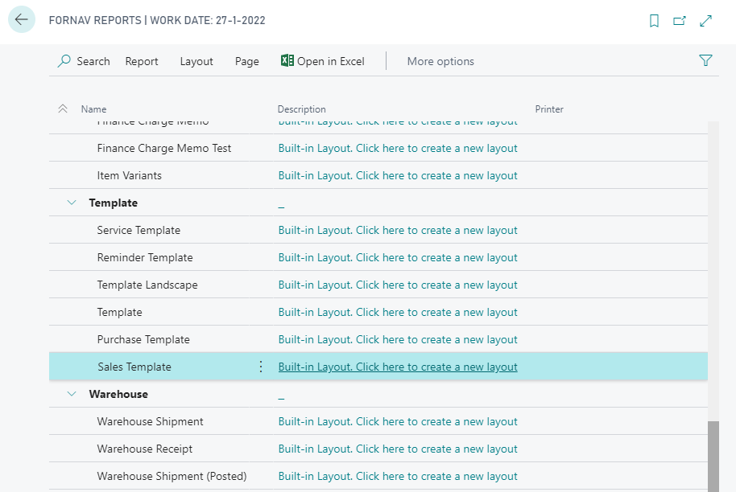
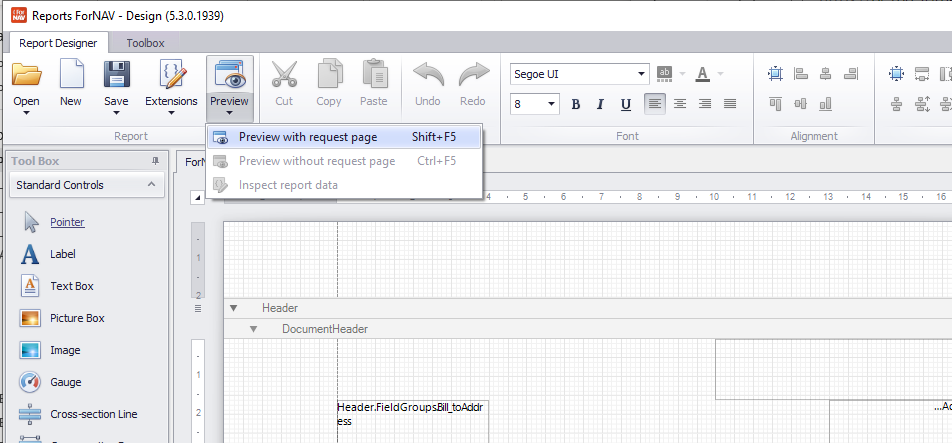
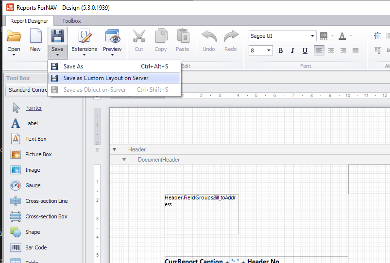

# Editing your first ForNAV report

## Changing a layout
If you would like to do more than just adding a logo, payment note, etc., you need to edit the layout of the report with the ForNAV designer. The ForNAV designer lets you modify the data that is displayed on the layout, the location on the page, fonts and colors, and everything else you might need to modify.

>  In order to edit a ForNAV report you need to [download](https://www.fornav.com/download/) and install the ForNAV designer.

In order to edit a ForNAV report you need to open the ForNAV Reports list in Business Central and click on the Built-in Layout link. This will open the report layout in the ForNAV Designer.

> ForNAV uses templates to inherit changes to a number of reports. Changing the Sales Template changes all ForNAV sales documents.

> ForNAV needs to connect to your Business Central tenant in order to get information on the reports, tables, and fields. That is why you see a login screen when you open the ForNAV designer.

## Preview your change
After you have made your changes you can preview them straight from the ForNAV designer. Just click the Preview button.

## Save your changes

When you are finished designing your report click Save. ForNAV will save the report as a Custom Report Layout on the server.

For further information you can watch the Coffeebreak video on adding fields from extensions to your reports.

    <iframe
        src="https://www.youtube.com/embed/CmZhj17JDWk?list=PLtpjnuA-F0c_XQ-y7kGZKAWCXeop7F7Wa?start=66&end=1004"
        frameborder="0"
        webkitallowfullscreen
        mozallowfullscreen
        allowfullscreen
        style="position: absolute; top: 0; left: 0; width: 100%; height: 100%;">
    </iframe>

