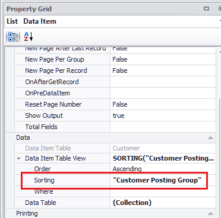
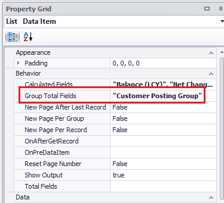
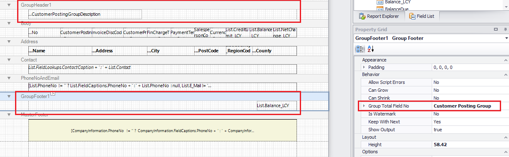

# Group Totals

Now that we know how to create totals for reports and totals per page we can discuss totals per group. With ForNAV it is possible to calculate the totals per group of records. All we need to do is specify the DataItem sorting, select the fields we want to group by and let ForNAV do the rest.

## Add group totals

In order to add group totals we need to do three things, set the document sorting, add group total fields, and add group headers and footers.

Consider this scenario, we have a customer list report where we want to calculate the totals for the customers with the same Customer Posting Group.

The first thing we do is to sort the Customer DataItem by Customer Posting Group.

The second thing we do is to set the Group Total Fields property on the DataItem

Th third and final thing we need to do is to add a group header and footer. ForNAV will calculate the totals automatically, as discussed on the Totals page.

> The property New Page Per Group triggers a new page per group.

## Further Learning

    <iframe
        src="https://www.youtube.com/embed/yemM2uJmMS4?start=46&end=657"
        frameborder="0"
        webkitallowfullscreen
        mozallowfullscreen
        allowfullscreen
        style="position: absolute; top: 0; left: 0; width: 100%; height: 100%;">
    </iframe>

