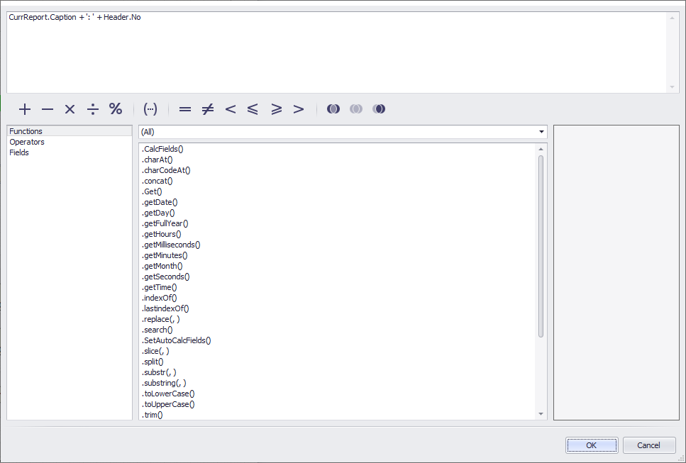

# JavaScript

## Why JavaScript
If you want to use conditional formatting, loop through data, or other things you can use JavaScript inside your ForNAV layouts to do these things.

There are many places inside ForNAV where you can use JavaScript. The one used most often is the Text Box. The simplest use of JavaScript may be concatenating several strings. Let's have a look at one of the Text Boxes in a standard ForNAV report.



In this Text Box the source expression is not just a single field. Two fields have been linked together with a simple line of JavaScript. This line simply strings two variables together with a connecting text.

```javascript
CurrReport.Caption + ': ' + Header.No
```

> You can use plain text inside your JavaScript, but you need to place that text between single '' or double "" quotes.

## Learn JavaScript

If you are new to JavaScript we can recommend these resources

Online Learning
* [Codecademy](https://www.codecademy.com/)
* [W3Schools JavaScript](https://www.w3schools.com/js/default.asp)

Videos
* [Learn JavaScript in one video](https://www.youtube.com/watch?v=fju9ii8YsGs)

## Triggers

There are many places inside ForNAV where you can write JavaScript. The Text Box is one of them. These are the others.

|Control                     |Trigger
|----------------------------|-----------------
|Text Box                    |Source Expression
|All Controls                |Show Output
|All Controls                |On Print
|Report                      |OnPreReport
|DataItem                    |OnPreDataItem
|DataItem                    |OnAfterGetRecord
|Section                     |Show Output

> Where a section is inherited from a master template that sections JavaScript is also inherited. JavaScript outside of sections, OnPreReport, DataItems, etc., are never inherited. The only exception to this is the OnPreReport Master Report property. This will inherit the OnPreReport script from a master template.

## Database functions in JavaScript

You can use all of the standard JavaScript functions in ForNAV. However, standard JavaScript has no functions for reading data from the Business Central database. ForNAV has embedded some of the DataBase functions inside the ForNAV JavaScript editor. 

|JavaScript                     |AL                             |
|-------------------------------|-------------------------------|
|Get();)                        |Get();                         |
|CalcFields(‘Picture’);         |CalcFields(Picture);           |
|SetAutoCalcFields(‘Balance’);  |SetAutoCalcFields(Balance);    |
|Init();                        |Init;                          |
|Next();                        |Next;                          |
|First();                       |FindFirst;                     |
|SetFilter(‘Name’, ‘Mark’);     |SetFilter(Name, ‘Mark’);       |
|SetRange(‘Name’, ‘Mark’);      |SetRange(Name, ‘Mark’);        |
|GetCaption()                   ||
|GetOptionValue(string ExternalFieldName)||
|GetFilter(string ExternalFieldName)||
|GetFilters()||
|<br>
|Case Sensitive                 |Not case sensitive             |
|Parentheses mandatory          |Parentheses somewhat mandatory |
|Fieldnames in single quotes	|Fieldnames not in quotes   	|
|Brackets {}                    |Begin...End;                   |

Usage Examples
```javascript
Line.GetOptionValue('Type');
ForNAVSetup.CalcFields('Logo');
Header.GetFilter('No');
Line.SetFilter('DocumentNo', Header.No);
```

> Whilst you can read data from the Business Central database it is not possible to write data to the Business Central database from inside a ForNAV Layout. If you need to do this, for instance to set the number printed, you need to edit the report AL file.

## JavaScript Order of execution

All triggers inside a ForNAV report trigger in a certain order.


## Demo Scripts

### Get comment lines

For maximum effect this should be placed in the OnPreReport trigger so it can be inherited by any reports that use it as a master template

```javascript
function GetComments(headerNo) {
  var comments;
  
  SalesCommentLine.SetFilter('DocumentType', SalesCommentLine.FieldOptions.DocumentType.PostedInvoice);
  SalesCommentLine.SetFilter('No', headerNo);
  if (SalesCommentLine.First()) {
    comments = SalesCommentLine.Comment;
  }
  
  while (SalesCommentLine.Next()) {
    comments += ' ' + SalesCommentLine.Comment;
  }
  return comments;
}
```
> The .Next() function cannot be used in Business Central cloud 

### Get comment lines as an array

Add this to the Header OnAfterGetRecord
```javascript
var comments = [];

function GetComments(headerNo, lineNo) {
  var _comments = [];
  var _comment;
  
  SalesCommentLine.SetFilter('DocumentType', SalesCommentLine.FieldOptions.DocumentType.PostedInvoice);
  SalesCommentLine.SetFilter('No', headerNo);
  SalesCommentLine.SetFilter('LineNo', lineNo);

  if (SalesCommentLine.First()) {
    _comment = {date:SalesCommentLine.Date, lineNo:Line.LineNo, comment:SalesCommentLine.Comment};
    _comments.push(_comment);
  }
  
  while (SalesCommentLine.Next()) {
    _comment = {date:SalesCommentLine.Date, lineNo:Line.LineNo, comment:SalesCommentLine.Comment};
    _comments.push(_comment);
  }
  return _comments;
}

function ParseComments(_comments) {
  var _parsedComment, i;
  _parsedComment = '';

  for (i = 0; i < _comments.length; i++) {
    _parsedComment += _comments[i].lineNo + ' ' + _comments[i].date + ' ' + _comments[i].comment + '\n ';
  }
  return _parsedComment;
}
```
> The .Next() function cannot be used in Business Central cloud 

Add this to the Line.OnAfterGetRecord
```javascript
comments.push.apply(comments, GetComments(Line.DocumentNo, Line.LineNo));
```

Add a new DataItem, set the source table as Integer and set MaxIteration on 1. Add a Body section with a Text control and add this as the source expression

```javascript
ParseComments(comments);
```

### Filter on empty or non empty values

```javascript
// Filter empty value (double quote, single quote, single quote, double quote)
SalesCommentLine.SetFilter('Code', "''");

// Filter Non empty value (double quote, <>, single quote, single quote, double quote)
SalesCommentLine.SetFilter('Code', "<>''");
```


### Get the bank account based on the currency

Add the Bank Account table to the records and get the record based on the currency.
```javascript
switch(Header.CurrencyCode) {
  case Header.CurrencyCode = 'EUR':
    BankAccount.Get('EURBANKNO');
    break;
  case Header.CurrencyCode = 'USD':
    BankAccount.Get('USDBANKNO');
    break;
  default:
    BankAccount.Get('DEFAULTBANKNO');
}
```

Add the Bank Account table to the records and find the first bank account for that currency.
```javascript
BankAccount.SetRange('CurrencyCode', Header.CurrencyCode);
BankAccount.First();
```

### Convert decimals to different Format

Converts any number to the US Format in 2 decimals
```javascript
Number.prototype.usFormat = function(){
  return this.toFixed(2).replace(/(\d)(?=(\d{3})+(?!\d))/g, "$1,");
}
```
Converts to US format without adding decimal places
```javascript
Number.prototype.usFormat = function(){
    return this.toString().replace(/(\d)(?=(\d{3})+(?!\d))/g, "$1,");
}
```

Call this function from any number:
```javascript
Header.Amount.usFormat();
```

Converts any number to the any format in any number of decimals
```javascript
/**
 * Number.prototype.format(n, x, s, c)
 * 
 * @param integer n: length of decimal
 * @param integer x: length of whole part
 * @param mixed   s: sections delimiter
 * @param mixed   c: decimal delimiter
 */
Number.prototype.format = function(n, x, s, c) {
    var re = '\\d(?=(\\d{' + (x || 3) + '})+' + (n > 0 ? '\\D' : '$') + ')',
        num = this.toFixed(Math.max(0, ~~n));

    return (c ? num.replace('.', c) : num).replace(new RegExp(re, 'g'), '$&' + (s || ','));
};

12345678.9.format(2, 3, '.', ',');  // "12.345.678,90"
123456.789.format(4, 4, ' ', ':');  // "12 3456:7890"
12345678.9.format(0, 3, '-');       // "12-345-679"
```
Via https://stackoverflow.com/questions/149055/how-to-format-numbers-as-currency-string

Call this function from any number:
```javascript
Header.Amount.format(2, 3, '.', ',');
```

### Get the number of decimal places

```javascript
Number.prototype.countDecimals = function () {
    if(Math.floor(this.valueOf()) === this.valueOf()) return 0;
    return this.toString().split(".")[1].length || 0; 
}
```

### Append and Prepend PDF Files

```javascript
ForNAVFileStorage.Get('TERMS', 'APPEND');
ForNAVFileStorage.CalcFields('Data');
CurrReport.GetDataItem('Header').Pdf.Append(ForNAVFileStorage.Data);

ForNAVFileStorage.Get('TERMS', 'PREPEND');
ForNAVFileStorage.CalcFields('Data');
CurrReport.GetDataItem('Header').Pdf.Prepend(ForNAVFileStorage.Data);
```

> From ForNAV Report Pack version 5.4.0.0 you can add image, pdf, and other files to the ForNAV File Storage table. The ForNAV File Storage table has two key fields, Code and Type. Therefore when you do a Get() on that table you need to specify both these fields.

### Add text and image watermarks

The watermark controls for a ForNAV report are all available in JavaScript. To add a text watermark add these lines.
```javascript
CurrReport.Watermark.Text.Font.Name = 'Comic Sans MS';
CurrReport.Watermark.Text.Font.Size = 50;
CurrReport.Watermark.Text.ForeColor = 'red';
CurrReport.Watermark.Text.Text = 'Watermark';
```

For an image watermark you can use the image or a pdf in a blob field as a watermark
```javascript
ForNAVFileStorage.Get('WATERMARK', 'IMAGE');
ForNAVFileStorage.CalcFields('Data');
CurrReport.Watermark.Image.Image = ForNAVFileStorage.Data;
```
> When you specify watermark controls they will be remembered. Therefore, when you don't want to display watermark text or images for a subsequent page you need to hide them using the CurrReport.Watermark.Text.Visible and CurrReport.Watermark.Image.Visible controls.

All of the watermark controls are:
```javascript
CurrReport.Watermark.Image.Visible Boolean
CurrReport.Watermark.Image.BackColor String
CurrReport.Watermark.Image.ForeColor String
CurrReport.Watermark.Image.Image Image

CurrReport.Watermark.Text.Font.Regular Boolean
CurrReport.Watermark.Text.Font.Bold Boolean
CurrReport.Watermark.Text.Font.Italic Boolean
CurrReport.Watermark.Text.Font.Strikeout Boolean
CurrReport.Watermark.Text.Font.Underline Boolean
CurrReport.Watermark.Text.Font.Name String
CurrReport.Watermark.Text.Font.Size Integer

CurrReport.Watermark.Text.Text String
CurrReport.Watermark.Text.BackColor String
CurrReport.Watermark.Text.ForeColor String
CurrReport.Watermark.Text.DeviceFont String
CurrReport.Watermark.Text.FormatString String
CurrReport.Watermark.Text.Hyperlink String
CurrReport.Watermark.Text.Visible Boolean
```

## Further Learning

* [Knowledge Base Dynamic control of fonts](https://www.fornav.com/knowledge-base/dynamic-control-of-color-and-font-in-text-boxes/ )
* [Online JavaScript Editor](https://js.do/)

<div style="position: relative; padding-bottom: 57.05229793977813%; height: 0;">
    <iframe
        src="https://www.youtube.com/embed/T-GY6ObU82c?start=127&end=941"
        frameborder="0"
        webkitallowfullscreen
        mozallowfullscreen
        allowfullscreen
        style="position: absolute; top: 0; left: 0; width: 100%; height: 100%;">
    </iframe>
</div>

