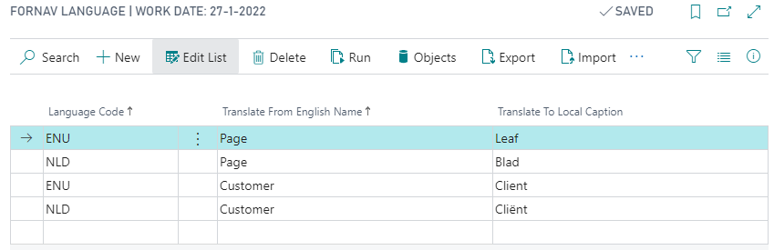
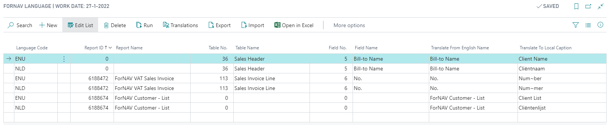

# ForNAV Language

The ForNAV language module lets us change and translate texts in our ForNAV reports without changing the layout itself. The ForNAV Language page has 2 options, Translation and Objects.

## Change ForNAV translations

If you just want to change some standard report texts like page or customer you can use the ForNAV Language page. On this page you can add a translation for things like standard ForNAV captions like Page, or Business Central captions like Customer. Translations should always be from the English original. Even though there might be a translation for the target language in the system.

> You can't change the translations for Label controls or JavaScript strings. If you want to translate these you need to add a translation to the report.

## Change object captions
If you want to change Business Central object captions for your report you will need to switch over to the objects view. To do so click on the Objects button at the top of the page.

In Objects mode, you can specify translations for a:

* Report caption – Table No. and Field No. are zero.
* Table caption – Table No. is the number of the table and Field No. is zero.
* Field caption – Table No. is the number of the table and Field No. is the number of the field.

In the below example the translations are:
Sales Header Bill-to Name is translated on all reports that use the Sales Header.
Sales Invoice Line No. is translated only in report 6188472 (VAT Invoice).
The Caption for the Customer List report is translated.

> Adding a soft hyphen (~) will break off long words in logical places. Num~ber will be broken off as: 
> Num  
> ber

## Learn more

https://www.fornav.com/knowledge-base/translation/ 

    <iframe
        src="https://www.youtube.com/embed/12t7j3rZqNo?start=92&end=648"
        frameborder="0"
        webkitallowfullscreen
        mozallowfullscreen
        allowfullscreen
        style="position: absolute; top: 0; left: 0; width: 100%; height: 100%;">
    </iframe>

