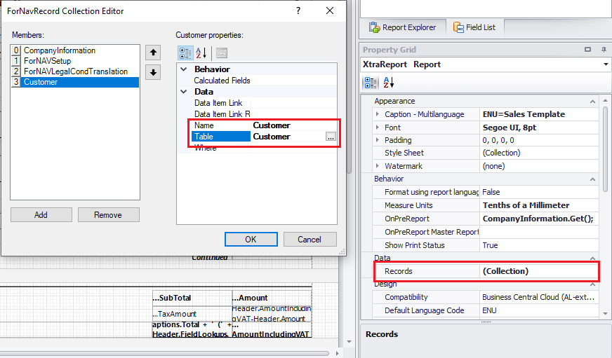
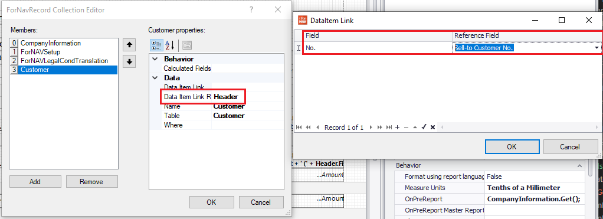
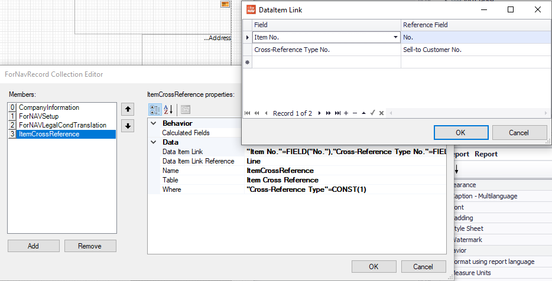
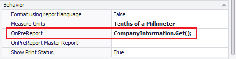

# Data from related records

Sometimes it is necessary to get data from related records. If you want to print a line of data per record you can do this by adding a DataItem. If you just want extra data you can do this by adding a record to your ForNAV layout.

This functionality is used for instance to get the item for a sales invoice line, or a customer for a sales invoice header.

## Define a record

There are two methods of adding a record to your ForNAV layout, by defining the data link or by getting the data with JavaScript. Both methods start with defining a new record in the Records property of the ForNAV layout.

When you drill down on the records property the Record Collection Editor will open. To add a new record click new and select the table. Drilling down on the table will open a table selection screen where you can choose the table you want to add. You can choose any table from any extension without adding dependencies. The Name property will be added automatically, you can edit this when needed.

> No two tables can have the same name in ForNAV. If you already have a DataItem called Item you cannot add a record called Item. You will need to specify an alternative name line Item2.

## Get data by Data Item Link

After you have added a record you can get the desired record by adding a Data Item Link or with JavaScript. A Data Item Link can be specified by selecting the DataItem from which to link and selecting the fields by which to get the record. In our customer example this would be the Header table, you can then link the No field to the Sell-to Customer No field from the header.

Another example would be to get the Item Cross Reference from the Sales Line. This example uses an additional filter in the Where property.

## Get data by JavaScript

Getting data by JavaScript can be as simple as adding a Get function in the report OnPreDataItem. Many ForNAV reports use this to get the Company Information table.

The JavaScript section discusses this method of getting data in further detail.

## Further Learning

    <iframe
        src="https://www.youtube.com/embed/rf9H4LW2qiE?start=103&end=650"
        frameborder="0"
        webkitallowfullscreen
        mozallowfullscreen
        allowfullscreen
        style="position: absolute; top: 0; left: 0; width: 100%; height: 100%;">
    </iframe>

