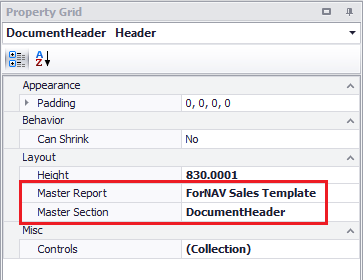

# Templates

ForNAV uses template technology. This means that you can use parts of a report as a master report. When you change the master report all the other reports based on this master report will change as well. In the ForNAV report pack this is demonstrated by the sales or purchase templates for instance.

What gets inherited from the master
* Everything in the inherited section
* OnPreReport JavaScript

What does not get inherited from the master
* Report properties like margins, paper size, etc.
* DataItem properties like Calculated fields, sorting, JavaScript triggers

## New sections

If you add a new section to a report template you will also need to add this manually to all the reports that use this template. You don't need to add the content of the section. That is controlled by the master section.

To connect a section to a master section you need to set the Master Report and Master Section properties in the Section properties.

> The content of master sections gets loaded when you open the report in the ForNAV designer. If you link a section to a master section you will need to close en reopen the report to view the changes. 

    <iframe
        src="https://www.youtube.com/embed/uyH_vrYMa50?start=99&end=841"
        frameborder="0"
        webkitallowfullscreen
        mozallowfullscreen
        allowfullscreen
        style="position: absolute; top: 0; left: 0; width: 100%; height: 100%;">
    </iframe>

