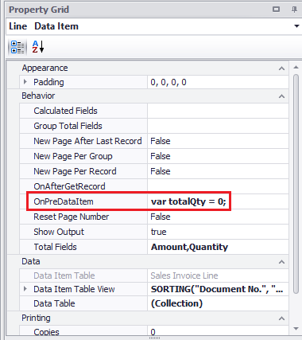
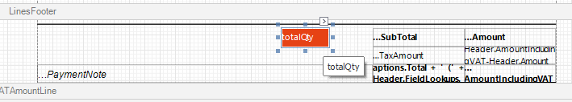

# Totals

Totaling is an important aspect of reporting. Reports like invoices always need to display a total. Calculating totals can be done in two ways with ForNAV, automatically or via JavaScript.

## Automatic totaling
In most cases automatic totaling in ForNAV will suit your needs. Whenever you add a numerical field to a Footer, Transport, or Group section ForNAV will automatically add the selected field to the DataItem Totals property.

In the below image the Quantity field has been added to the TransFooter section. In the properties of the DataItem you will notice that the Quantity field has been added. Once this has been done ForNAV will automatically calculate the totals for the Quantity field.


> If you add a total field in a template report you will need to manually set the Total Fields property for all the reports that use the Template section. DataItem properties will not be copied automatically from a template report. 

## Manual totaling with JavaScript.

In some cases the automatic totaling will not be sufficient. You might need to calculate the total based on a filter or you may need to do more advanced calculation first. In that case you can work with JavaScript to calculate your totals.

Let's say we want to calculate only the total quantity for the item lines. The first thing you will need to do is create a variable that you can use. The best place for these variables is on a DataItem OnPreDataItem.

```javascript
var totalQty = 0;
```



The next step is to calculate the total. We can do this on the DataItemOnAfterGetRecord. JavaScript you put here will be triggered after retrieving a record from the database.


```javascript
if (Line.Type == Line.FieldOptions.Type.Item) {
  totalQty += Line.Quantity;
}
```
Finally we create a new textbox in a footer section and use our JavaScript variable as the source expression.



> If you add JavaScript in a template report you will need to manually set this script for all the reports that use the Template section. DataItem properties will not be copied automatically from a template report. 

## Further Learning

<div style="position: relative; padding-bottom: 57.05229793977813%; height: 0;">
    <iframe
        src="https://www.youtube.com/embed/BPUcps9Fj7Q?start=93&end=381"
        frameborder="0"
        webkitallowfullscreen
        mozallowfullscreen
        allowfullscreen
        style="position: absolute; top: 0; left: 0; width: 100%; height: 100%;">
    </iframe>
</div>