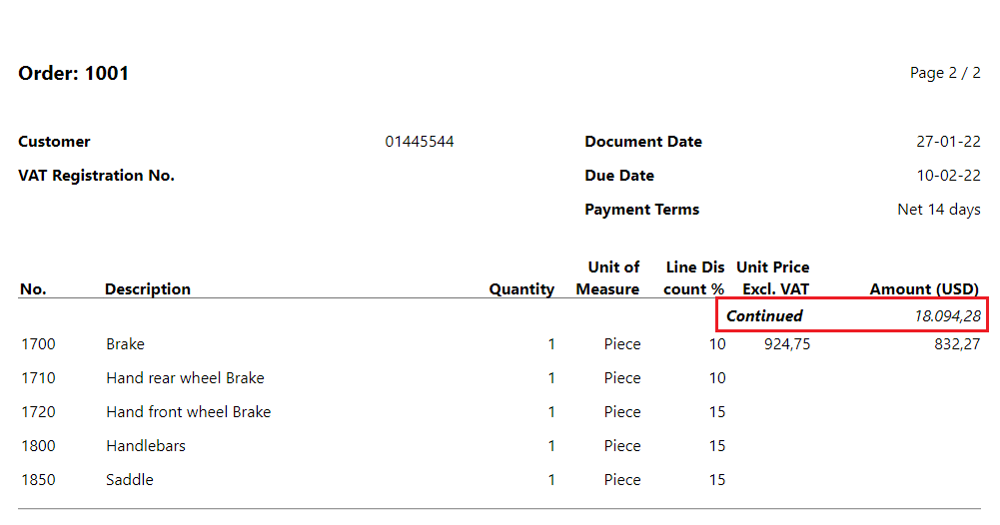
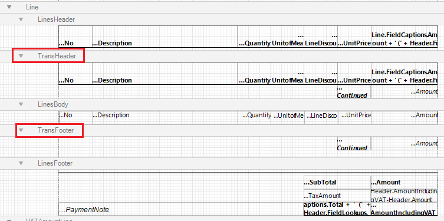

# Transport Totals

In some cases it may happen that your documents spill over to follow up pages, like when you have an order confirmation with many lines. In these cases it may be necessary to display the carry over totals to the next page. In ForNAV we call these transported totals. All sales documents in the ForNAV Customizable Report Pack have these transported totals.

## Add transport totals

In order to add transport totals we need to do two things, the first is calculate the totals, the totals page details how to do this. The second is to create new sections where we want to place these totals. These sections are called TransHeaders and TransFooters. You can add these just like normal sections, by right clicking the DataItem where you want to add these sections and selecting Insert Section. Further configuration is not required. ForNAV will automatically determine when to print these sections and will automatically print the correct totals.

## Further Learning

    <iframe
        src="https://www.youtube.com/embed/BPUcps9Fj7Q?start=381&end=600"
        frameborder="0"
        webkitallowfullscreen
        mozallowfullscreen
        allowfullscreen
        style="position: absolute; top: 0; left: 0; width: 100%; height: 100%;">
    </iframe>

