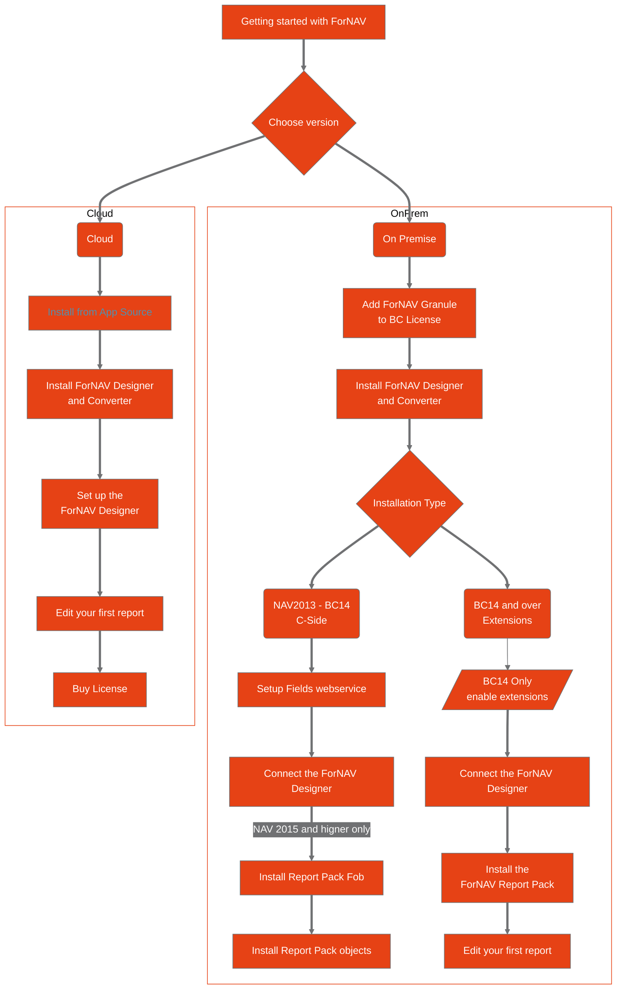

# ForNAV Guide

Welcome to the ForNAV getting started guide. Please follow the flow chart to get started. Alternatively you can select your Microsoft Dynamics 365 Business Central version to get started.

classDef default fill:#e64215,Color:white,stroke:#333,stroke-width:1px;

%%{init: {'theme': 'base', 'themeVariables': { 
  'darkMode' : 'true',
  'primaryColor': '#e64215',
  'primaryBorderColor': '#707173',
  'primaryTextColor': 'white',
  'secondaryColor':'#707173',
  'lineColor': '#707173',
  'edgeLabelBackground': '#707173',
  'tertiaryColor': 'white',
  'textColor': '#707173',
  'tertiaryBorderColor': '#e64215'
}}}%%
