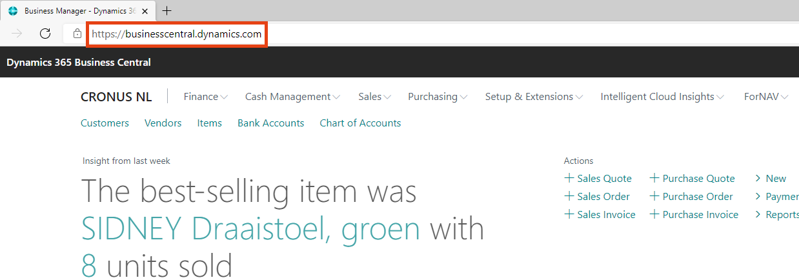

# ForNAV Guide

Welcome to the Reports ForNAV getting started guide. This guide is meant to be both a guide to help new ForNAV users to get started and as a reference for experienced ForNAV users. 

Please select your Microsoft Dynamics 365 Business Central version to get started. The guide will run you through the entire process of setting up and using ForNAV.

## Choose your Business Central version to get started

  
Business Central SaaS
 
  
Business Central On Premise
 

> To determine if you are using Business Central On Premise or SaaS please have a look in the address bar of your browser at  the URL you are using. If this starts with businesscentral.dynamics.com please select SaaS. In any other case you are using  Business Central On Premise, even if it is hosted in the cloud
> 
> 